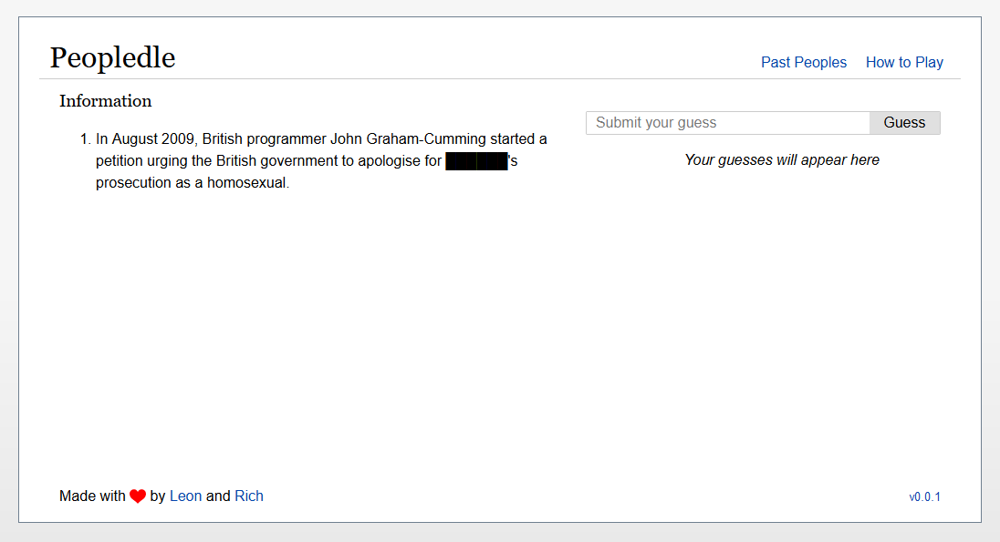

# Peopledle: Guess the Person

[]([https://](https://github.com/Pop101/Peopledle/issues))

# Table of Contents

- [Peopledle: Guess the Person](#peopledle-guess-the-person)
- [Table of Contents](#table-of-contents)
- [Overview](#overview)
- [Technologies](#technologies)
- [Getting Started](#getting-started)
  - [Usage](#usage)

# Overview

Guess the person from 5 sentences about them from their wikipedia page.
Every guess reveals more information about the person, starting from obscure sentences from their page, to more and more revealing ones.



# Technologies

This project is created with:

- [Flask](https://flask.palletsprojects.com/en/2.0.x/): 2.0.2
- [Waitress](https://docs.pylonsproject.org/projects/waitress/en/stable/): 2.1.2
- [SVG Spinners](https://github.com/n3r4zzurr0/svg-spinners)
- [AP Scheduler](https://apscheduler.readthedocs.io/en/stable/): 3.9.0
- [AnyAscii](https://github.com/anyascii/anyascii): 0.3.1
  
# Getting Started

Clone the Repo \
```git clone https://github.com/Pop101/Peopledle``` \
Enter the repo and Install requirements \
```cd Peopledle && sudo python3 -m pip install -r requirements```

Launch the webserver \
```python3 webserver.py```

## Usage

Just connect to the webserver and start guessing! \
```http://localhost:8787```

You can always customize anything in
```config.yml```, just note that doing so
might require you to restart the webserver
or redownload the people (delete the ```./data/``` folder)
